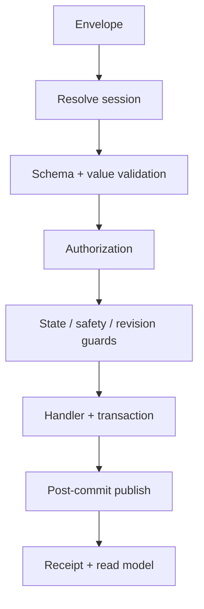

# Application/API Contracts

## Scope

This document defines the concrete v1 contract shape for the VB.NET/.NET Framework 4.8 Solution. It is transport-neutral and in-process. It does not authorize remote control or choose a dependency-injection library, messaging product or SQLite provider.

## Project references

| Project | May reference | Must not reference |
|---|---|---|
| `UTS.Core` | BCL only | WPF, SQLite, driver/vendor assemblies |
| `UTS.Application.Contracts` | `UTS.Core` | WPF, SQLite, driver/vendor assemblies |
| `UTS.Application` | Contracts, Core | WPF, concrete SQLite/PLC adapters |
| `UTS.Infrastructure.SQLite` | Application Contracts, Core | WPF |
| `UTS.Infrastructure.Hardware` | Application Contracts, Core | WPF, analysis implementation |
| `UTS.Presentation.Wpf` | Application Contracts | SQLite, PLC/vendor adapters |
| `UTS.Bootstrapper` | all composition targets | domain behavior |

All production projects target `.NET Framework 4.8`, `x86`, and VB.NET. Tests may have separate executables but may not introduce C# production code.

## Core contract types

### Identity and time

```text
RequestId / CorrelationId / EntityId : lowercase canonical GUID string
Utc timestamp                       : DateTimeOffset normalized to UTC
Run ordering                         : Int64 Sequence + Int64 MonotonicNanoseconds
SchemaVersion                        : positive Int32
Hash                                 : lowercase SHA-256 hexadecimal
```

Application code obtains identifiers, UTC and monotonic time from ports so tests are deterministic. It does not call random/time APIs inside domain rules.

### Engineering quantity

```text
EngineeringQuantity
  Value          : finite Double
  QuantityKind   : controlled identifier
  UnitCode       : controlled identifier
```

Construction validates finite values and compatible units. Conversion returns a new value plus the conversion-revision identity; it never mutates source evidence.

### Command envelope

```text
CommandEnvelope(Of TPayload)
  RequestId
  CommandType
  SchemaVersion
  CorrelationId
  CausationId?
  RequestedAtUtc
  ActorSessionId
  AggregateId?
  ExpectedRevision?
  Payload
```

The handler ignores any client-supplied display name or role as authorization evidence. `ActorSessionId` resolves to trusted `ActorContext` before handling.

### Command receipt

```text
CommandReceipt
  RequestId
  CorrelationId
  OperationId?
  Outcome        : Accepted | Rejected | Failed | TimedOut
  ReasonCode
  AggregateId?
  AggregateRevision?
  RecordedAtUtc
```

`ReasonCode` is always present. Success uses a stable code such as `SYSTEM.ACCEPTED` rather than localized prose.

### Query result

```text
QueryResult(Of TProjection)
  ContractVersion
  ProjectionVersion
  GeneratedAtUtc
  Data
  Warnings[]
```

Collections are read-only snapshots. Live change delivery uses explicit subscriptions/read-model refresh, not mutable repository entities.

## Handler interfaces

The Solution scaffold shall expose generic interfaces equivalent to:

```text
ICommandHandler(Of TCommand)
  HandleAsync(envelope, cancellationToken) As Task(Of CommandReceipt)

IQueryHandler(Of TQuery, TResult)
  ExecuteAsync(query, actorSession, cancellationToken) As Task(Of QueryResult(Of TResult))
```

These are conceptual signatures; exact VB.NET namespaces are fixed during the Solution scaffold. Cancellation is advisory and only honored before an irreversible/unsafe effect. Stop, protective reactions and committed evidence are not rolled back because a caller cancels.

## Processing pipeline



Pipeline rules:

1. malformed schema/value returns `VALIDATION.*` without effects;
2. untrusted/expired session returns `AUTH.*`;
3. expected-revision conflict returns `CONCURRENCY.*`;
4. motion evaluates a fresh authoritative interlock snapshot;
5. persistence error rolls back the transaction and is recorded/correlated;
6. publication occurs after commit and is replayable from durable events where required.

## Transaction boundaries

| Use case | Atomic durable boundary |
|---|---|
| Release Method | revision lifecycle, validation evidence, audit |
| Prepare Run | run row plus preparation state journal/event |
| Snapshot Run | snapshot, all bindings, content hash, audit |
| Arm/Start/Hold/Resume/Stop | command journal, state journal/event, current state and device acknowledgement evidence as applicable |
| Append raw chunk | chunk, gap/quality evidence and committed sequence in a short writer transaction |
| Complete/Fault Run | finalized raw marker, terminal state, EndReason, event and audit |
| Re-Analyze | new analysis revision and durable operation identity; outputs commit as immutable revision |
| Acceptance | evaluation plus all rule results |
| Report | immutable report record plus content-addressed artifact identity |
| Settings activate | new configuration revision, predecessor state and audit |

No transaction is kept open while waiting for UI input, report rendering, long analysis computation or network/device acknowledgement. A driver acknowledgement is coordinated with persisted command state using explicit operation/reconciliation state rather than a long SQLite transaction.

## Machine command serialization

One coordinator owns each `MachineId` command lane. Priority is:

1. emergency/safety observation;
2. protective stop;
3. JOG End or operator Stop;
4. hold/controlled completion;
5. start/resume/jog begin;
6. non-motion setup commands.

`TimedOut` closes the lane to new motion and enters reconciliation until fresh status proves a safe authoritative state. Pending motion is never auto-replayed after reconnect.

## JOG lease contract

| Operation | Required payload | Result/effect |
|---|---|---|
| `BeginJog` | MachineId, direction, typed speed preset, input-capture identity | accepted lease or stable rejection |
| `RenewJogLease` | LeaseId, fresh hold/input proof | extends only the same active lease |
| `EndJog` | MachineId and optional LeaseId/reason | permissionless idempotent stop request |

There is at most one active lease per machine. Exact lease duration is injected from versioned machine configuration and cannot be assumed until hardware validation. Application/window close and input/focus loss invoke `EndJog`; lease expiry is the final fail-closed backstop.

## Read models

The minimum immutable projections are:

- `ShellStatusProjection`: connection, machine/run state, highest safety severity, active fault and freshness;
- `CommandAvailabilityProjection`: command, `CanRequest`, reason code and snapshot version;
- `ReceptionOrderProjection`: Order, customer snapshot, specimens and planned tests;
- `RunPreparationProjection`: resolved revisions, missing inputs and readiness gates;
- `RunConfigurationReviewProjection`: exact snapshot identities/hash before Arm;
- `LiveTestProjection`: validated/derived values, units, quality and segment state;
- `ChartProjection`: processed/derived display points and event markers only;
- `AnalysisProjection`: revision lineage, events, properties and overrides;
- `CalibrationReadinessProjection`: sensor/install/calibration/binding validity;
- `SettingsProjection`: effective configuration revisions and pending restart/reinitialize flags;
- `ReportProjection`: immutable input revisions, generated artifacts and audit links.

Every safety/status projection includes freshness. A stale projection must show stale/unknown and cannot be converted to Ready/Enabled locally by a ViewModel.

## Streaming ports

| Port | Producer/consumer | Constraint |
|---|---|---|
| `IRawSampleSink` | Acquisition → persistence | bounded immutable batches; no UI subscriber |
| `IValidatedMeasurementStream` | validation → calculation/live projection | ordered sequence, unit and quality provenance |
| `IRawReplaySource` | persistence → controlled analysis replay | Application authorization; streaming chunks; x86 bounded |
| `IDerivedMeasurementStream` | calculation → detectors/properties/live projection | analysis/pipeline revision required |
| `IDomainEventPublisher` | committed facts → consumers | post-commit; idempotent EventId |
| `ILiveProjectionStream` | projection → WPF | disposable/decimated; prohibited as analysis input |

Backpressure policy is explicit per port. Overflow or dropped scientific data becomes quality/fault evidence; only disposable display updates may be coalesced.

## Public surface rule

Only use cases in `DOMAIN/APPLICATION_COMMAND_QUERY_CATALOG.md` are exposed to Presentation. Repositories, Unit of Work, raw SQL, driver commands and mutable domain entities are internal ports, not a UI API.

## Versioning

- Command and event payloads use positive integer schema versions.
- Adding optional fields may retain a schema version only when old consumers remain deterministic; otherwise increment it.
- Removing/renaming fields or changing meaning always increments the version.
- Handlers reject unsupported future versions with `VALIDATION.UNSUPPORTED_SCHEMA_VERSION`.
- Persisted canonical payloads record their schema version and SHA-256.

## External transport gate

Before any external API is enabled, a separate Frozen decision must define:

- allowed non-motion and motion use cases;
- authentication, authorization and credential lifecycle;
- TLS/certificate policy and network trust boundary;
- replay/idempotency ledger and rate limits;
- audit/redaction and incident handling;
- remote Stop behavior and machine risk-assessment impact;
- availability, update and backward-compatibility policy.

Until then, no listener port is opened by default.
