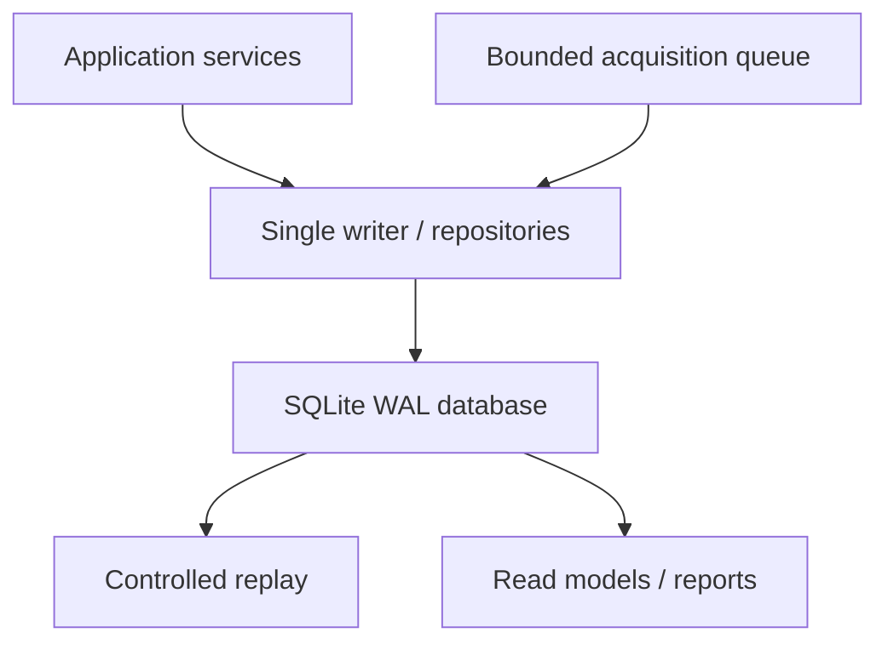

# SQLite Physical Model

## Persistence flow

WPF ViewModels, drivers and analysis engines never execute ad-hoc SQL. The Application layer owns transactions and repository contracts. Acquisition sends immutable chunks to the bounded writer; replay reads chunks as a stream.

## Table groups

| Group | Principal tables | Purpose |
|---|---|---|
| Schema/reference | `schema_migration`, `unit_definition`, `unit_conversion_definition`, `artifact` | migration ledger, controlled/versioned unit conversion and hashed files |
| Business | `customer_order`, `order_customer`, `specimen`, `specimen_revision` | Order-rooted work and immutable tested geometry |
| Method | `test_method`, `test_method_revision`, `method_phase`, `method_segment`, `method_channel_requirement` | released executable program and logical requirements |
| Analysis/acceptance definitions | `analysis_recipe`, `analysis_recipe_revision`, `material`, `material_revision`, `acceptance_profile`, `acceptance_profile_revision`, `acceptance_rule` | separately versioned scientific and pass/fail inputs |
| Metrology | `machine`, `measurement_channel_definition`, `sensor`, `sensor_installation`, `calibration_revision`, `calibration_point`, `zero_tare_revision`, `compliance_correction_revision` | physical identity and immutable calibration/correction history |
| Run snapshot | `test_run`, `run_configuration_snapshot`, `run_channel_binding` | exact resolved evidence used to arm and execute |
| Measurement | `raw_sample_chunk`, `stream_metadata`, `sample_gap`, `derived_series_chunk` | chunked raw/processed series with sequence/time provenance |
| Execution/event | `run_state_journal`, `command_journal`, `domain_event` | state, guarded commands and immutable semantic facts |
| Results | `analysis_revision`, `detected_event`, `calculated_property`, `acceptance_evaluation`, `acceptance_rule_result` | reproducible analysis and verdict lineage |
| Output/governance | `report_record`, `configuration_revision`, `audit_log`, `import_record` | outputs, settings, provenance and audit |

## Cardinality and ownership invariants

- `customer_order` is the aggregate root. `order_customer` is a one-to-one order-owned snapshot; no database relationship makes Customer the owner of Orders.
- A `specimen` belongs to one Order. Each tested configuration points to one immutable `specimen_revision`.
- A stable Test Method owns many immutable revisions. One revision owns ordered phases and segments.
- Material and Acceptance are separate from Test Method. A Run snapshot references them independently.
- A Run owns one immutable configuration snapshot before arming and many raw chunks.
- A Run may own many analysis revisions. Only one may be marked current by an explicit application transaction; older revisions remain immutable.
- Acceptance evaluates one analysis revision against one acceptance-profile revision and never updates the calculated property.
- Every run channel binding resolves logical channel → installation → sensor → calibration, with optional zero/tare and compliance correction.

## Identity and revision convention

Stable aggregate IDs and revision IDs are canonical lowercase GUID strings. Human-readable codes (`order_number`, method name/version label, sensor serial) are alternate keys, never primary identity.

Revision tables contain:

- stable aggregate foreign key;
- positive `revision_no` unique within the aggregate;
- optional predecessor revision;
- lifecycle/status;
- canonical payload/hash where required;
- created/released/approved actor and UTC timestamps.

No released revision is edited in place.

## Typed quantities and units

Columns representing quantities use a consistent triple where appropriate:

| Column | Meaning |
|---|---|
| `*_value` | finite numeric value |
| `*_quantity_kind` | Force, Length, Time, Stress, Strain, Rate, etc. |
| `*_unit_code` | FK to controlled `unit_definition` |

High-rate chunk payloads declare their channel layout and unit codes in versioned stream metadata. The source unit and canonical unit are both captured in run bindings/import records.

Initial controlled conversions include force `N`, `kN` and `kgf`; length `mm`; time `s`; stress `MPa`; strain ratio and percent. Force is normalized to N. The exact conventional conversion for kgf is stored as scale `9.80665` with zero offset.

## Run lifecycle persistence

`test_run.status` is a read-optimized current state. `run_state_journal` is the authoritative append-only transition history. A transition transaction writes the journal entry, updates current state and appends the matching `domain_event` atomically.

Terminal states require:

- typed end reason;
- finalized raw-buffer marker;
- final sequence/count summary;
- corresponding immutable domain event;
- audit entry for operator/process termination.

Application restart reconciles journal state with the driver safe-state handshake. It never infers Ready from a stale current-state column.

## Measurement chunks

Raw chunk uniqueness is `(run_id, stream_id, first_sequence)`. The application validates that the next chunk starts after the prior `last_sequence`; an overlap-protection trigger rejects intersecting ranges.

Each raw chunk contains:

- stream/schema/codec version;
- first/last sequence and sample count;
- first/last monotonic time and UTC capture time;
- channel-layout revision;
- quality mask/summary;
- BLOB payload, payload byte count and SHA-256.

`derived_series_chunk` has the same shape but is owned by an `analysis_revision` and derived channel. Display caches are disposable and are not represented as scientific series.

## Index strategy

Indexes serve actual access paths:

- Order number/status/date and Order → Specimen;
- stable aggregate → revision descending;
- Run status/start time/specimen/method revision;
- raw chunk stream and sequence range;
- event Run/type/occurrence sequence;
- analysis Run/revision and property code;
- sensor serial/status and calibration applicability interval;
- audit aggregate/time and correlation ID.

No index is added to BLOB payloads or free-form notes. Query plans for run loading, live finalization, replay and report generation become performance acceptance tests after representative datasets exist.

## Delete behavior

Historical/evidence foreign keys use `RESTRICT`. Mutable catalogs may be retired with `status` and timestamps. `CASCADE` is permitted only for unreleased Draft child rows whose aggregate root is being discarded before use; the initial schema conservatively uses `RESTRICT` for evidence.

## Artifact store

An `artifact` row references a path relative to the managed artifact root. Paths are normalized, cannot escape the root and are never trusted as user-supplied absolute paths. The persistence service writes to a temporary file, fsyncs, computes SHA-256, atomically renames, then commits metadata. Orphan reconciliation is an explicit maintenance operation.

## Backup set

A valid backup contains:

1. a checkpointed consistent SQLite copy;
2. all referenced artifact content;
3. a manifest with database schema version, application build, file hashes and creation UTC;
4. restore-verification results.

Copying a live `.db` file without the associated WAL/checkpoint procedure is not a valid backup.
