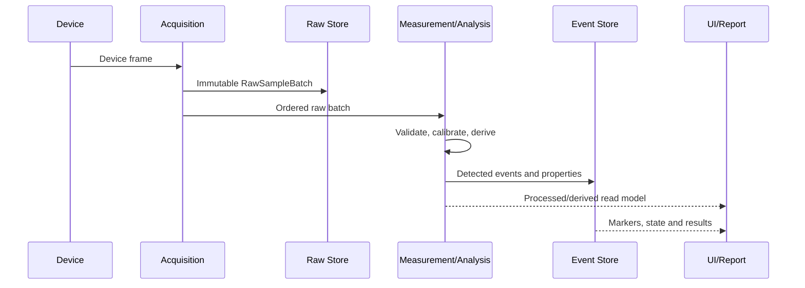

# Data Flow Architecture

## Boundary map

| Boundary | Input | Output | Responsibility |
|---|---|---|---|
| Device Driver | Physical device protocol | Device frames/status | Protocol isolation only |
| Acquisition | Device frames | `RawSampleBatch` | Sequencing, timestamps, buffering, acquisition quality |
| Raw Repository | Raw batches | Replay stream | Immutable persistence and retrieval |
| Measurement Pipeline | Raw/replay stream | `ValidatedMeasurementFrame` | Calibration, units, validity and quality |
| Analysis Pipeline | Validated frames | Derived frames, events, properties | Scientific processing and versioned algorithms |
| Acceptance | Properties and approved context | Decision results | Rule evaluation with uncertainty/risk metadata |
| Presentation Read Models | Processed/derived streams and events | UI state | Display, interaction and operator feedback |
| Reporting | Stored traceability bundle | Versioned report/export | Reproducible output |

## Non-negotiable invariants

1. Hardware adapters do not contain analysis, acceptance or UI behavior.
2. WPF ViewModels do not read PLC registers or raw acquisition buffers.
3. Raw data is immutable and never replaced by corrected data.
4. Display decimation never changes analytical or persisted data.
5. Every derived value identifies the pipeline, method, calibration and input revision used.
6. Every detected event identifies its source sample sequence or range.
7. Re-analysis reads retained raw data and creates new lineage.
8. Re-Test creates a new run with new raw data.
9. Loss, overflow, saturation and stale values are explicit quality/fault conditions.
10. Safety decisions do not depend on the UI thread or report/graph consumers.

## Logical sequence

## Implementation gate

No Solution code for the acquisition or analysis pipeline may be treated as production-ready until its public contracts implement the types, provenance and invariants defined by EDR-0001 and all applicable scientific requirements under EDR-0014.
