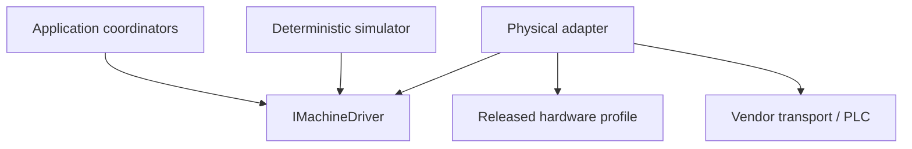

# Driver and PLC Architecture

## Dependency boundary

- Application owns semantic requests and orchestration.
- Driver contracts contain no WPF, SQLite or vendor types.
- Adapter owns native frames, addresses, word order and write sequences.
- `SafetySupervisor` consumes typed fresh status; it does not read PLC points itself.
- Analysis and Reporting have no reference path to the driver assembly.

## Assembly intent for the future VB.NET Solution

| Assembly | Responsibility | Allowed references |
|---|---|---|
| `UTS.Application.Contracts` | driver DTOs/ports used by coordinators | Core contracts only |
| `UTS.Infrastructure.Driver.Abstractions` | shared adapter utilities and conformance harness | Application contracts |
| `UTS.Infrastructure.Driver.Simulator` | deterministic virtual machine | abstractions/contracts |
| `UTS.Infrastructure.Driver.FaconFatek` | vendor transport and released profile interpreter | abstractions/contracts and isolated COM wrapper |
| `UTS.Infrastructure.Composition` | selects one adapter and profile | approved concrete projects |
| `UTS.Presentation.Wpf` | status/read models and commands only | Application contracts; never driver concrete projects |

All target .NET Framework 4.8 and x86. Vendor COM objects remain inside the Facon/Fatek adapter and are never placed in a DTO.

## Concurrency model

- One driver session and one serialized command lane exist per MachineId.
- Status polling/acquisition, command execution and WPF rendering use independent workers.
- Stop/JOG End pre-empt queued ordinary motion intents at the coordinator boundary.
- No driver wait occurs inside an SQLite write transaction.
- Status snapshots are immutable; consumers cannot mutate shared buffers.
- Shutdown first blocks new motion, requests assessed stop when needed, drains bounded evidence, then disconnects.

## Data paths

| Path | Payload | Rule |
|---|---|---|
| status | coherent `DriverStatusSnapshot` | freshness and unknown state are explicit |
| measurement | bounded `RawMeasurementFrameBatch` | raw provenance preserved; never domain events |
| command | typed `DriverCommand` → receipt | no arbitrary native address/value |
| diagnostics | redacted counters and stable codes | raw unrestricted frames never returned to UI |
| map evidence | immutable profile revision and artifacts | version/hash bound to every session/run snapshot |

## Reconciliation

Reconciliation begins after restart, reconnect, acknowledgement timeout, late acknowledgement, contradictory status or unclean shutdown. It:

1. prevents new non-stop motion;
2. obtains a fresh coherent status using the intended released profile;
3. compares observed state with the command/state journals;
4. records discrepancies and stationary proof;
5. transitions through Application state guards;
6. never reconstructs or resumes a prior motion command.

Only Application coordinators may declare reconciliation complete.

## Capability negotiation

Capabilities are immutable for a driver session and include supported command kinds/versions, control modes, sampling modes/rates, measurement channels, coherent-read groups, JOG presets, hold behavior, acknowledgement support and diagnostic limits. The adapter may advertise less than the profile; it may never advertise more.

An unavailable or unverified capability is absent, not returned with a permissive default.

## Security and configuration

Connection secrets and transport endpoints are protected configuration references. Audit stores profile/session/build identities, not credentials. Production packages do not expose a generic PLC console. Commissioning diagnostics require explicit authorization, separate mode selection and immutable evidence.

## Completion boundary

This architecture can be approved before the actual map is released. The physical adapter remains monitor-only/write-disabled until every commissioning gate passes.
