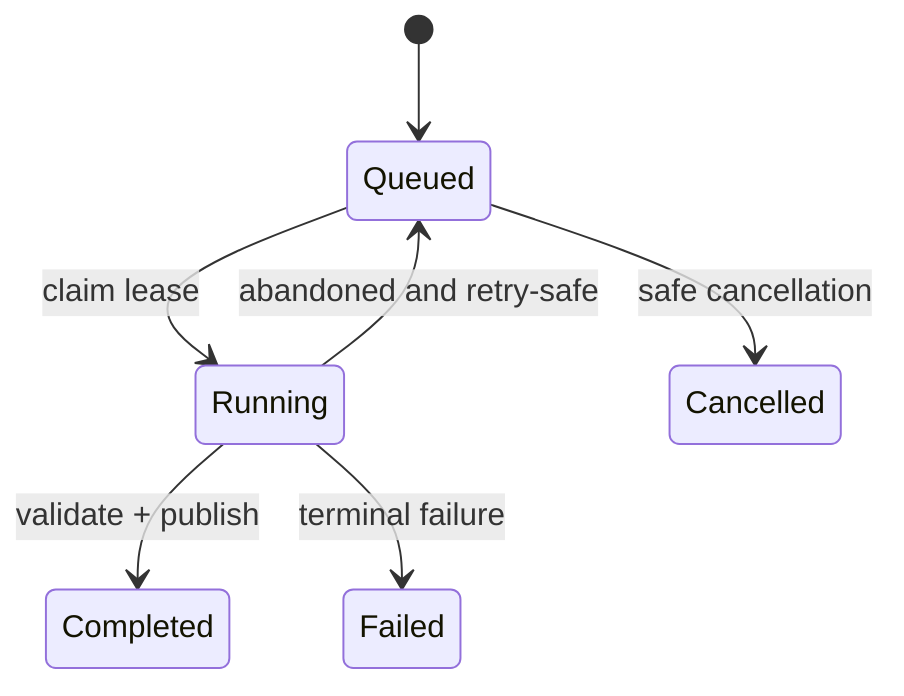

# Durable Operations and Recovery Architecture

## Operation flow

SQLite is the durable authority. Workers use short Application-owned transactions, immutable attempts and atomic artifact publication. Progress projections are disposable; terminal facts are durable.

## Startup modes

| Mode | Permitted behavior |
|---|---|
| `Starting` | compatibility/integrity/recovery checks only |
| `DiagnosticsRecovery` | diagnosis, verified backup/restore and controlled repair; no run/motion |
| `SimulatorOperational` | normal software workflows with Simulator identity visible |
| `PhysicalMonitorOnly` | approved read-only physical observations only |
| `PhysicalOperational` | unavailable until all EDR-0009 commissioning gates pass |

Recovery never resumes a Run or replays a motion command. Incomplete evidence is finalized if provable; otherwise it is faulted with retained provenance.

## Concurrency boundaries

- one SQLite writer service per installation;
- one serialized command lane per MachineId;
- bounded acquisition and projection streams;
- durable operation workers never hold a database write transaction during computation/rendering;
- shutdown blocks new motion, obtains stop/reconciliation evidence, then drains or faults accepted buffers.
