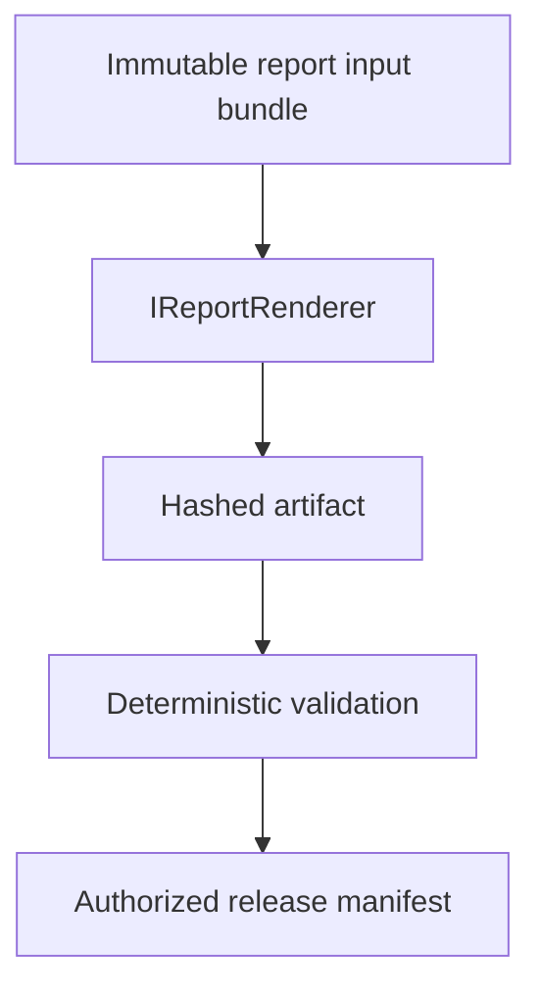

# Reporting, Validation and Release Architecture

## Reproducible pipeline

The renderer has no raw-replay, machine-driver or scientific-calculation port. It consumes calculated properties, qualified events, acceptance results and immutable context only.

## Required ports

| Port | Responsibility |
|---|---|
| `IReportInputBundleRepository` | atomically persist/read the exact input revision set |
| `IReportRenderer` | render one declared format from one immutable bundle/template |
| `IReportValidator` | deterministic content/claim/layout/artifact validation |
| `IReportReleaseService` | enforce permission, separation and exact validated hash |
| `IArtifactStore` | content-addressed temporary write, hash and atomic publish |

CSV and PDF are separate format adapters. PDF remains unavailable for production release until a .NET Framework 4.8/x86-compatible renderer passes the defined compatibility and visual-regression gate.

## Non-production labeling

Simulator output always carries a visible non-production mark in every page/manifest and cannot be released as a physical specimen report. Imported data retains source/provenance classification and cannot imply machine commissioning.
