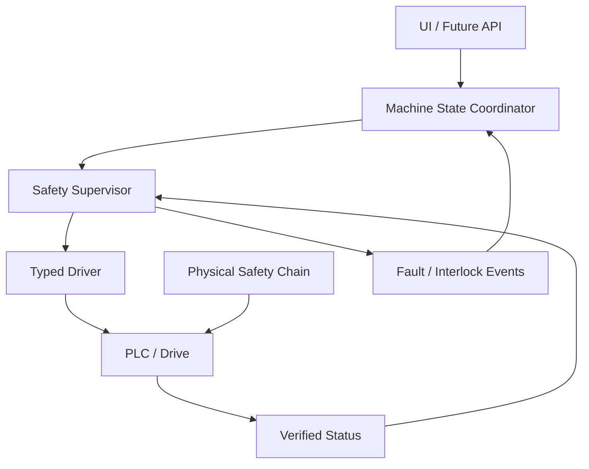

# Safety and Interlock Architecture

## Command path

## Fail-closed rule

Motion authorization is a short-lived result of current, fresh, mutually consistent evidence. It is not a sticky Boolean. Any required unknown/stale status denies a new motion command.

## Software boundaries

- Core defines immutable safety/interlock value objects and pure guard evaluation.
- Application owns `SafetySupervisor`, state coordination, audit and permission checks.
- Infrastructure reads typed hardware status and writes typed commands.
- Presentation renders the interlock snapshot and rejection reason.
- No Presentation or Analysis code writes device registers.

## Commissioning status

This architecture is Frozen. Physical safety behavior is **not commissioned**. No numeric safety limit, PLC address, stop time, Performance Level or certification claim is Frozen until the open hardware verification items in EDR-0004 are completed.
