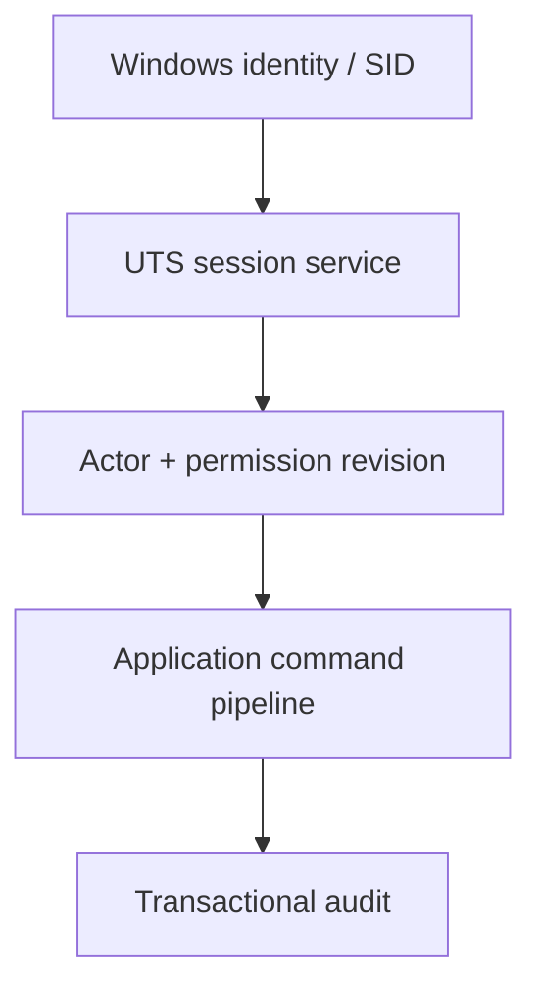

# Security and Session Architecture

## Trust flow

Presentation provides a SessionId and command payload only. Application resolves the trusted Windows identity, Actor, permissions and separation policy. Infrastructure persists identity mappings and audit but never decides command authorization.

## Fail-closed conditions

Unknown/disabled Actor, changed Windows identity, expired session, Windows lock/logoff, retired permission revision and unavailable security configuration deny ordinary mutations. They never cancel an accepted Stop or protective reaction.

## Project ownership

| Component | Responsibility |
|---|---|
| `UTS.Core` | immutable Actor/permission identifiers and pure policy value objects |
| `UTS.Application.Contracts` | session-aware command/query contracts; no trusted role in payload |
| `UTS.Application` | Windows identity/session resolution, authorization and separation policy |
| `UTS.Infrastructure.SQLite` | Actor/role/permission/session-audit persistence |
| `UTS.Presentation.Wpf` | lock state, permission projections and localized rejection messages |
| `UTS.Bootstrapper` | selects Windows-integrated identity provider; opens no listener |

Passwords, access tokens and unrestricted device frames are prohibited from DTOs, audit payloads, logs and diagnostics.
