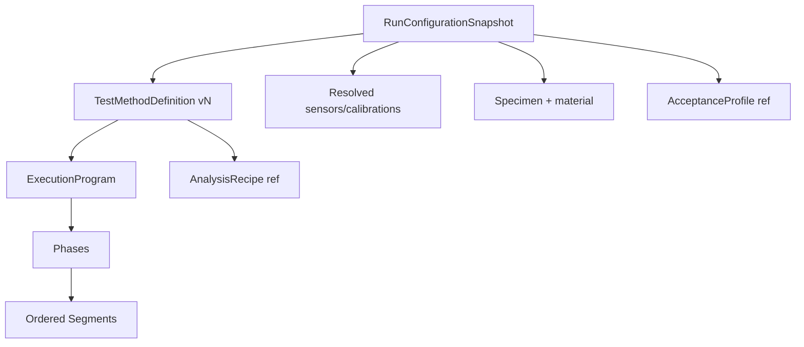

# Executable Test Method Domain Model

## Aggregate relationships

## Ownership rules

| Information | Owner |
|---|---|
| Motion, target, rate, transition, method termination | Test Method |
| Per-segment recording and sampling | Test Method |
| Logical measurement/control requirements | Test Method |
| Actual specimen dimensions and constants | Specimen |
| Material properties and hints | Material Library |
| Pass/Fail, uncertainty, tolerance and risk | Acceptance Profile |
| Physical sensor identity and calibration revision used | Run Configuration Snapshot |
| Machine hard limits, interlocks and E-stop | Safety/Machine Configuration |
| Calculated items and detector parameters | Versioned Analysis Recipe |
| Display axes/layout | Chart Profile |
| Output layout | Report Template |

## Minimal public contracts

The first implementation must define interfaces equivalent to:

- `ITestMethodRepository`;
- `ITestMethodValidator`;
- `IMethodReleaseService`;
- `IRunConfigurationResolver`;
- `IExecutionProgramCompiler`;
- `IMachineCapabilityProvider`;
- `IAnalysisRecipeRepository`.

The Core project owns method value objects and pure validation rules. Application services own orchestration, persistence boundaries and authorization. Presentation owns the seven-tab editors and may not bypass release/arming validation.

## Run snapshot rule

No production test starts from a live mutable editor model. The application first creates and persists an immutable `RunConfigurationSnapshot`, then compiles it into runner instructions. The snapshot is the traceability root for execution, replay, analysis and reporting.

## Open dependencies

The following are intentionally not invented here:

- exact machine/test states and command guards — EDR-0003;
- safety priority and interlocks — EDR-0004;
- physical sensor/range/calibration rules — EDR-0005;
- event names and payload schemas — Event Dictionary;
- purchased-standard formulas and numeric thresholds — controlled Standard specifications.
