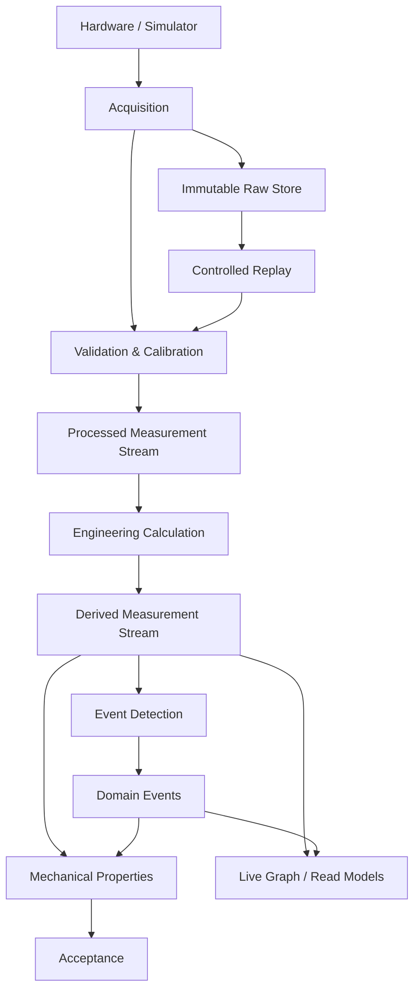

# EDR-0001 — Measurement Streams and Domain Events

## Context

The original GR-013 stated that every downstream engine consumes Events and that no engine calculates directly from raw measurements. This correctly prevented UI, acceptance and reporting code from bypassing the analysis pipeline, but it also implied that continuous numerical data could be replaced by sparse semantic events.

That implication is invalid. Stress, strain, modulus, smoothing, break detection, graphing and deterministic re-analysis require ordered measurement series. Events such as Yield, Break, Hold, Fault and Stop identify meaning; they do not replace the samples from which that meaning was derived.

## Decision

UTS has two separate, connected flows:

1. **Measurement data stream** — ordered numerical observations and derived series.
2. **Domain event stream** — semantic facts detected from data or emitted by machine/test state transitions.

Neither flow substitutes for the other.

## Canonical data types

| Type | Purpose | Mutable? |
|---|---|---:|
| `RawSampleBatch` | Exact acquired values, device timestamps, host timestamp, sequence range and acquisition quality | No |
| `ValidatedMeasurementFrame` | Unit-normalized, calibrated and quality-annotated measurements | No |
| `DerivedMeasurementFrame` | Calculated series such as Stress, Strain, True Stress and True Strain | No |
| `DetectedEvent` | Semantic landmark with type, time, sample provenance, rule and confidence/quality | No |
| `CalculatedProperty` | Scalar or structured result such as Rm, Rp0.2, modulus or energy | No |
| `AcceptanceDecision` | Versioned Pass/Fail/Indeterminate outcome with evaluated rules | No |

Corrections and re-analysis create new revisions. They never rewrite an acquired or previously published record.

## Consumption rules

| Consumer | Measurement stream | Domain events | Direct raw access |
|---|---:|---:|---:|
| Validation and calibration | Required | Optional diagnostics | Pipeline entry only |
| Signal processing | Required | Optional boundaries | No |
| Engineering calculation | Required | Optional segment markers | No |
| Event detection | Required | Produces events | No |
| Mechanical property engine | Required where mathematically needed | Required where semantically needed | No |
| Acceptance engine | No sample-level dependency by default | May consume qualified events | No |
| Live graph | Processed/derived stream | Markers and annotations | No |
| Report engine | Stored processed results | Events and traceability | No |
| UI command logic | No numerical control decisions | State/domain events and read models | No |

An engine must declare its input contract. "Event driven" means state changes and semantic facts are communicated as events; it does not mean numerical series are encoded as events.

## Raw-data rule

Raw data is an immutable audit source and the deterministic input to a named analysis-pipeline revision. Only the acquisition persistence boundary and the controlled replay pipeline may read raw batches.

Mechanical property, acceptance, reporting and UI modules may not bypass validation, calibration, unit normalization or engineering calculation.

## Ordering and time

Every run has:

- a stable `RunId`;
- a monotonically increasing sample sequence;
- device time when available;
- host monotonic elapsed time for ordering;
- UTC wall-clock time for audit;
- explicit gap, overflow, stale, saturation and communication-quality flags.

Wall-clock time alone must never determine sample order.

## Event provenance

Every detected event records:

- `EventId`, `RunId` and event type;
- source sequence or source sequence range;
- event time;
- detector and rule version;
- input pipeline revision;
- algorithm parameters;
- quality/confidence;
- optional operator override with reason, user and audit record.

This enables graph markers, recalculation and audit to resolve to the same source data.

## Deterministic replay

Given the same immutable raw batches, calibration revision, method revision, specimen geometry, analysis pipeline revision and algorithm parameters, re-analysis must reproduce the same processed series, events and properties within declared numerical tolerances.

Re-analysis writes a new analysis revision and lineage. It never reacquires data. Re-Test creates a new run and new raw data; historical runs are not physically overwritten.

## Concurrency and backpressure

- Acquisition must not execute on the WPF UI thread.
- Storage uses bounded buffers and batch writes.
- Overflow, dropped batches and communication gaps are explicit faults or quality states; they are never silently ignored.
- Live graph rendering may decimate display data, but persisted and analytical streams remain independent from display decimation.
- Slow reporting or UI consumers may not block acquisition.
- Shutdown and controlled stop must drain or explicitly mark pending buffers.

The concrete queue implementation remains an implementation choice constrained by .NET Framework 4.8 and x86 memory limits.

## Resulting flow

## Consequences

### Positive

- Continuous calculations remain numerically correct.
- Events retain semantic value without carrying high-rate samples.
- Replay, correction, audit and graph markers share explicit provenance.
- UI, PLC and reporting cannot bypass the scientific pipeline.
- Acquisition and rendering can scale independently.

### Costs

- Two coordinated persistence paths are required.
- Sequence/provenance metadata must be designed into every contract.
- Re-analysis and operator overrides require revision lineage.
- Integration tests must verify ordering, gaps, replay and backpressure.

## Rejected alternatives

1. **Encode every sample as a domain event** — rejected because it mixes telemetry with business meaning and creates unnecessary dispatch/storage overhead.
2. **Allow each engine to read raw data directly** — rejected because calibration, validation and revisions would diverge.
3. **Keep only processed data** — rejected because traceability and future re-analysis would be lost.
4. **Use UI graph data as analysis input** — rejected because display decimation would corrupt scientific results.

## Verification requirements

Before Milestone A is complete, automated tests must prove:

- monotonic ordering and gap detection;
- immutable raw persistence;
- deterministic replay;
- no silent buffer overflow;
- graph decimation isolation;
- event-to-sample provenance;
- re-analysis lineage;
- Re-Test creation of a distinct run;
- rejection of direct raw access by forbidden layers.

# End of EDR
