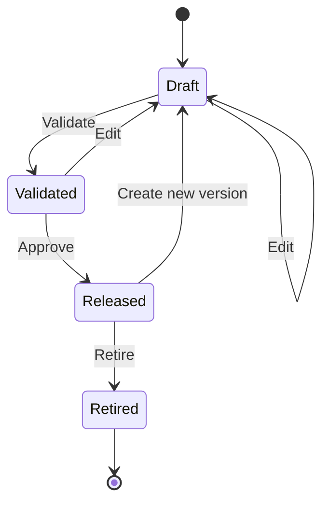

# EDR-0002 — Executable Test Method Model

## Context

UTS must support simple tensile/compression tests and later cycle, control, flexure, spring, ring-stiffness and other methods without replacing the execution engine. The supplied Shimadzu-derived workflow confirms an ordered method editor and per-area acquisition behavior, but its UI groups specimen, material, acceptance and reporting concerns inside one wizard.

The UTS Golden Rules require Test Method to remain separate from Material and Acceptance. A production model must therefore preserve the familiar seven-tab workflow while keeping domain ownership explicit.

## Decision

A released Test Method is an immutable, versioned executable definition. It declares:

- how the machine shall move;
- what logical measurements are required;
- when data is recorded and at what rate;
- how execution transitions or terminates;
- which versioned analysis recipe is requested;
- which operator actions are required.

A Test Method does **not** own material properties, acceptance limits, customer rules, machine safety limits, physical calibration records or mutable specimen results.

## Aggregate boundaries

| Aggregate | Owns | Does not own |
|---|---|---|
| `TestMethodDefinition` | Method identity/version, method family, execution program, acquisition plan, logical channel requirements, detector references and analysis recipe reference | Material, acceptance, physical calibration, customer, result |
| `MethodDeploymentProfile` | Optional machine-specific defaults such as preferred sensor identities and compatible fixture references | Calibration values or safety bypass |
| `SpecimenDefinition` | Actual specimen geometry, dimensions, constants and material selection | Machine program or acceptance rules |
| `AcceptanceProfile` | Limits, decision rules, uncertainty/risk handling and enablement | Machine movement |
| `RunConfigurationSnapshot` | Exact released method, resolved sensors/calibrations, specimen geometry, material, acceptance, report template and operator context used for one run | Later mutable edits |

The seven-tab Method UI may compose these aggregates, but persistence and versioning must not collapse them into one database entity.

## Test Method structure

```
TestMethodDefinition
  MethodId
  Version
  Name
  Description
  MethodFamily
  StandardReference?
  LifecycleStatus
  RequiredCapabilities[]
  RequiredChannels[]
  ExecutionProgram
    Phases[]
      Segments[]
  AnalysisRecipeReference
  DefaultChartProfileReference?
  DefaultReportTemplateReference?
  CreatedBy / CreatedAt
  ReleasedBy / ReleasedAt
```

A standard reference identifies the controlled standard and revision. It does not silently import formulas, limits or acceptance values.

## Method families

The extensible method-family identifier initially recognizes:

- Single;
- Cycle;
- Control.

Tensile, compression, flexure and other test types are profiles built on these execution families. New families are registered through versioned capabilities, not by adding UI-specific Boolean flags.

Texture and unverified purchased-standard methods remain reference-only until separate validated specifications exist.

## Execution program

An execution program contains ordered phases. A phase groups segments that share purpose, such as setup, conditioning, measurement or return. A segment is the smallest deterministic executable unit.

### Required segment contract

| Field | Meaning |
|---|---|
| `SegmentId` | Stable identity within the method version |
| `Ordinal` | Explicit deterministic order |
| `Purpose` | Approach, Preload, Measure, Hold, Unload, Return or OperatorAction |
| `ControlMode` | Requested logical control mode |
| `Direction` | Positive, Negative or NotApplicable in normalized machine coordinates |
| `Target` | Typed engineering value when the mode requires a target |
| `Rate` | Typed engineering rate when the mode requires a rate |
| `TransitionCondition` | Normal condition that completes the segment |
| `TerminationConditions[]` | Method-level conditions that stop the run |
| `AcquisitionProfile` | Recording state, sampling policy and required channels |
| `Repeat` | Optional bounded repeat definition |
| `OperatorPrompt?` | Versioned prompt/action contract |
| `DetectorReferences[]` | Versioned live detector rules used by transitions/termination |

All physical quantities carry quantity type, value and unit. Unitless numeric targets are invalid.

## Control modes

The domain vocabulary supports capability-driven control, including:

- crosshead/stroke rate or position;
- load/force rate or target;
- extension rate or target;
- strain rate or target;
- timed hold;
- controlled stop;
- operator action.

A method may request a mode only when the active machine, sensor binding and driver declare the required capability. Unsupported modes block arming; they never fall back silently.

## Transition and termination

A **transition condition** completes the current segment and advances to the next one. A **termination condition** ends the test program. Safety faults are neither; they are governed independently and always have priority.

Supported condition categories include:

- target reached;
- elapsed duration;
- qualified detected event;
- bounded repeat complete;
- operator confirmation;
- external synchronized input;
- composite AND/OR conditions with deterministic evaluation.

Arbitrary scripts, unbounded loops and runtime mutation of released method logic are prohibited in the minimal version.

Break termination references a versioned live Break detector. It is not a Boolean containing hidden threshold logic.

## Acquisition profile

Sampling belongs to the execution segment, not to a single global application setting.

Each segment declares:

- `RecordingMode`: Off, Record or Inherit;
- `SamplingPolicy`: fixed-rate initially, extensible to validated adaptive policies;
- `SampleRateHz` or typed interval when fixed;
- required logical channels;
- optional pre-trigger/post-trigger retention when supported.

A non-recording approach segment may move before the measurement phase. Safety and diagnostic telemetry remain available even when analytical recording is Off.

Changing sample rate at a segment boundary must create an explicit stream metadata record. Silent rate changes are prohibited.

## Analysis recipe

The method references a versioned `AnalysisRecipe`, which defines requested calculated items, detector rules, formula/DAG definitions, marker behavior and analysis parameters.

Acceptance thresholds do not live in the recipe. The Acceptance Profile evaluates calculated properties after analysis.

Graph and report references are presentation/output defaults. They cannot change execution or scientific calculations.

## Sensor requirements and resolution

The method declares logical requirements such as Load, Stroke and Extension, plus capability/range/class requirements when verified.

A `MethodDeploymentProfile` may store preferred physical sensors for operator convenience. Before arming, the application resolves actual sensor identities and valid calibration revisions into the `RunConfigurationSnapshot`.

A preferred sensor is never proof that the sensor is installed, correctly mounted or in calibration. CEDR-003 and the detailed sensor contract remain open until EDR-0005.

## Seven-tab UI mapping

The approved Method experience remains:

1. **System** — family/type, controlled standard reference and units.
2. **Sensor** — logical requirements plus deploy-time binding/status.
3. **Testing** — phases, segments, transitions, terminations and per-segment sampling.
4. **Specimen** — edits or selects a separate Specimen template/instance; it is not stored inside the method aggregate.
5. **Data Processing** — Analysis Recipe and external Acceptance Profile binding, shown as separate ownership.
6. **Chart** — default chart profile reference.
7. **Report** — default report template reference.

The UI may save these coordinated selections as a reusable workspace, but each aggregate retains its own identity and revision.

## Lifecycle and versioning



- Draft versions are editable and cannot arm a production run.
- Validation is deterministic and records all errors/warnings.
- Released versions are immutable.
- Editing a released method creates a new Draft version with lineage.
- A run stores the exact released method revision; later edits never alter history.
- Retired methods remain readable for historical replay.

## Validation gates

Before release:

1. identifiers and ordering are valid;
2. the program has a reachable normal completion;
3. repeats are bounded;
4. every quantity has a compatible unit;
5. every requested channel and control mode declares a capability requirement;
6. every detector/analysis dependency resolves to a version;
7. the calculation dependency graph is acyclic;
8. sampling profiles are valid and within declared platform capability;
9. no Material or Acceptance rule is embedded;
10. no machine safety limit or bypass is embedded.

Before arming a run:

1. the method revision is Released;
2. machine capabilities satisfy the method;
3. sensors and calibration revisions are resolved;
4. specimen geometry and required inputs are complete;
5. safety/interlock readiness is true;
6. acquisition capacity satisfies every segment;
7. operator permissions and required prompts are satisfied;
8. the complete `RunConfigurationSnapshot` is persisted.

## Consequences

### Positive

- Simple and multi-segment tests share one deterministic runner.
- Per-area sampling is modeled without special cases.
- The seven-tab professional workflow is preserved.
- Material, Acceptance, calibration and safety remain independently versioned.
- Re-analysis can reuse method/analysis revisions without reacquisition.
- Machine-specific bindings do not destroy method portability.

### Costs

- The UI coordinates several aggregates rather than saving one large object.
- Deployment and arming validation are mandatory.
- Version lineage and typed engineering quantities require explicit persistence.

## Rejected alternatives

1. **One mutable MethodConfig containing everything** — rejected because it violates GR-004 and destroys traceability.
2. **Hard-coded tensile workflow** — rejected because cycle/control methods require segments.
3. **Physical sensor/calibration values inside the method** — rejected because installed hardware and calibration revisions change independently.
4. **One global sampling period** — rejected because different segments require different acquisition profiles.
5. **Arbitrary user scripting in v1** — rejected because execution must remain bounded, auditable and safety-reviewable.

## Verification requirements

Before the executable method layer is complete, automated tests must prove:

- released versions are immutable;
- edits create new version lineage;
- invalid/unbounded programs cannot release;
- unsupported control modes cannot arm;
- per-segment sampling transitions are explicit;
- method data contains no Material/Acceptance/safety ownership;
- the same released snapshot produces deterministic runner instructions;
- Re-Analyze does not invoke machine execution;
- seven-tab UI editors map to the correct aggregate boundaries.

# End of EDR
