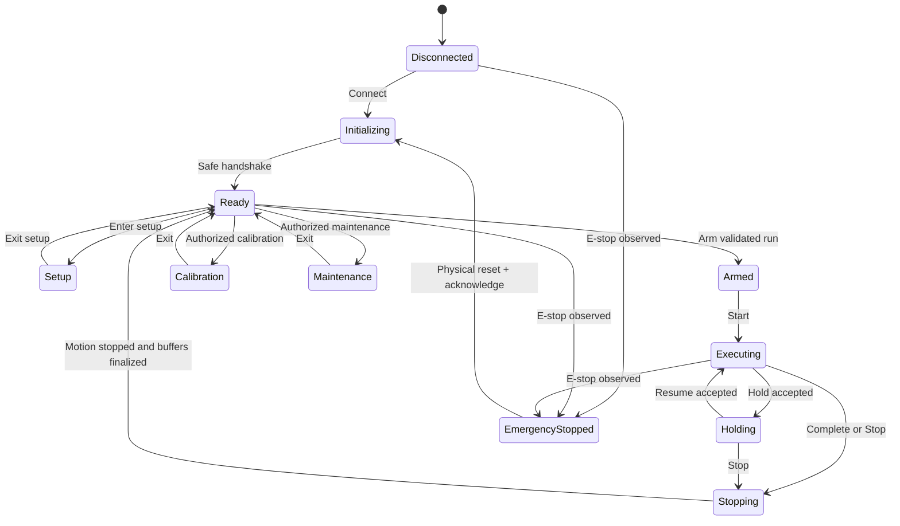

# EDR-0003 — Machine and Test State Machines

## Decision

Machine state and Test Run state are separate, coordinated state machines. They must not be represented by shared strings, unrelated Boolean flags or ViewModel properties.

Only the Application state-machine services may accept commands and publish authoritative transitions. UI, PLC adapter, analysis and report code observe state; they do not invent it.

## Machine states

| State | Meaning |
|---|---|
| `Disconnected` | No trusted device session |
| `Initializing` | Driver connection, capability read and safe-state verification |
| `Ready` | Connected, stationary and eligible for a guarded next action |
| `Setup` | Manual specimen/fixture positioning is permitted under JOG interlocks |
| `Armed` | A validated Run Configuration Snapshot is loaded; motion has not started |
| `Executing` | Test program is actively executing |
| `Holding` | Controlled test hold/pause; safety monitoring remains active |
| `Stopping` | A controlled stop is in progress; new motion commands are rejected |
| `Calibration` | Authorized calibration workflow; production test commands rejected |
| `Maintenance` | Authorized service workflow; production test commands rejected |
| `Faulted` | A non-emergency fault is latched and requires clear plus acknowledgement |
| `EmergencyStopped` | Emergency-stop condition is latched; software cannot reset the physical chain |

`Completed` is not a machine state. Completion belongs to Test Run; the machine returns through `Stopping` to `Ready`.

## Test Run states

| State | Meaning |
|---|---|
| `None` | No active run |
| `Preparing` | Inputs are being assembled and validated |
| `ReadyToArm` | Configuration is complete but not yet committed to the machine |
| `Armed` | Immutable snapshot persisted and machine armed |
| `Running` | Execution program active |
| `Paused` | Operator/method pause accepted; run remains active |
| `Stopping` | Termination sequence active |
| `Completed` | Method reached a normal completion |
| `Aborted` | Operator or process stop ended the run before normal completion |
| `Faulted` | Safety/device fault ended the run |
| `Cancelled` | Preparation ended before arming |

Every terminal run stores a typed `EndReason`; state alone is not enough.

## Coordination invariants

- Machine `Executing` requires Test Run `Running`.
- Machine `Armed` requires Test Run `Armed`.
- Test Run `Completed`, `Aborted` or `Faulted` requires raw-buffer finalization and an audit event.
- Machine `Setup`, `Calibration` and `Maintenance` are mutually exclusive with an Armed/Running run.
- Entering `Faulted` or `EmergencyStopped` forces an active run to `Faulted`.
- Leaving a fault state never resumes prior motion.
- Application restart reconstructs state from the device safe-state handshake and persisted run journal; it never assumes `Ready`.

## Normal transitions

Fault transitions from every energized/connected state are implicit and have priority over normal transitions.

## Command handling

Commands are requests. A command result is one of:

- `Accepted` with correlation ID;
- `Rejected` with stable reason code;
- `Failed` after acceptance with fault details;
- `TimedOut` with safe-state reconciliation required.

A button becoming disabled is not a command guard. The state machine validates every command even if it came from UI, automation, recovery or a future API.

## Core command guards

| Command | Required machine/run state | Additional conditions |
|---|---|---|
| Connect | Disconnected | Driver configuration available |
| Enter Setup | Ready / no active run | Setup permission and safety ready |
| JOG Up/Down | Setup / no active run | Hold-to-run input, direction/speed/interlocks valid |
| JOG Stop | Any connected state | Always accepted and idempotent |
| Arm | Ready + ReadyToArm | Released method, persisted snapshot, safety and capabilities valid |
| Start | Armed + Armed | Start permission and final readiness check |
| Hold | Executing + Running | Method/driver supports controlled hold |
| Resume | Holding + Paused | Fault-free, hold released, guard re-evaluation |
| Stop | Armed/Executing/Holding | Always accepted and idempotent |
| Enter Calibration | Ready / no active run | Calibration permission and calibration interlocks |
| Acknowledge Fault | Faulted | Cause cleared, stationary proof and permission |
| Reset after E-stop | EmergencyStopped | Physical E-stop reset observed; software acknowledgement only |

## Manual positioning

- The Position/JOG panel may remain visible in the Test workspace.
- Motion controls are enabled only in `Setup`.
- Up and Down are press-and-hold commands; release issues JOG Stop.
- Explicit Stop remains available and idempotent.
- There is no software clutch or Hold/Step coupling mode.
- Approved UI speed presets are `0.1 / 1 / 10` mm/min; actual drive capability and mapping must be verified before enabling each preset.
- The selected direction is visibly indicated; Stop uses the approved red flashing feedback while a stop is demanded or motion stop is unconfirmed.
- Safety/interlock evaluation, not UI visibility, governs motion.

## Hold semantics

A programmed Hold segment is part of the execution program and does not change Test Run to `Paused`. An operator Hold command requests a controlled transition to Machine `Holding` and Test Run `Paused`.

This distinction prevents a normal dwell from being confused with operator intervention.

## Persistence and audit

Every accepted/rejected motion command and every state transition records:

- correlation ID;
- prior and next state;
- command/event type;
- UTC and monotonic time;
- operator/service identity;
- guard result and reason code;
- device acknowledgement;
- related RunId and segment ID when applicable.

High-rate samples remain in the measurement stream under EDR-0001; they are not state-transition events.

## Verification

Automated state-model tests must cover every permitted transition, every rejected transition, idempotent Stop, fault priority, restart recovery and absence of automatic motion after reset. Simulator integration tests must prove UI commands cannot bypass guards.

# End of EDR
