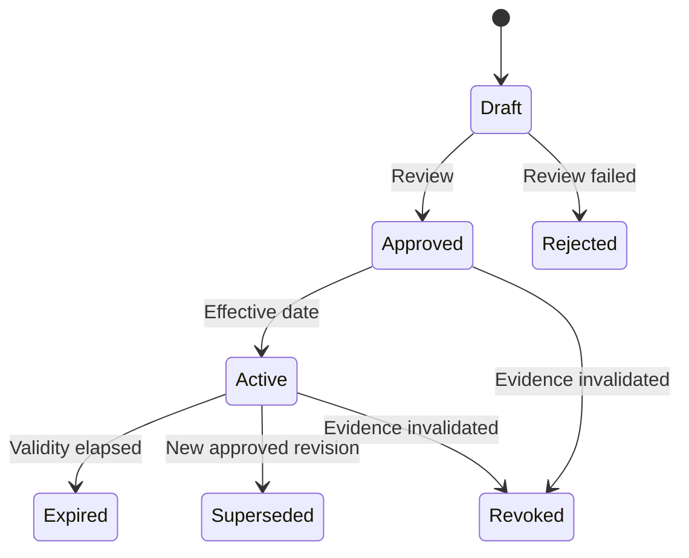

# EDR-0005 — Measurement Channel, Sensor and Calibration Contracts

## Decision

Logical measurements, physical sensors, installations, calibration revisions and run bindings are separate versioned concepts.

A channel name cannot stand in for a sensor, and a selected sensor cannot stand in for a valid calibration. Every production run persists the exact resolved chain used to produce its measurements.

## Core logical channels

The logical channels always defined by the platform are:

- Load;
- Stroke;
- Extension;
- Time.

Optional channels are registered through the same contract. Calculated channels such as Stress and Strain are analysis outputs under GR-010, not physical acquisition channels.

"Always defined" does not mean a physical sensor is always connected. Required unavailable channels block arming; optional unavailable channels carry explicit availability/quality state.

## Entity separation

| Entity | Identity and responsibility |
|---|---|
| `MeasurementChannelDefinition` | Logical quantity, role, engineering unit policy and channel metadata |
| `SensorDefinition` | Physical transducer identity, type, manufacturer/model/serial, nominal capability and verified metadata |
| `SensorInstallation` | Sensor mounted at a machine/location, orientation, sign convention and effective interval |
| `CalibrationRevision` | Immutable calibration/verification record for one sensor and measurement configuration |
| `ChannelBinding` | Maps one logical channel role to a sensor installation for a deployment/run |
| `ZeroTareRevision` | Run/setup correction with provenance; never rewrites calibration |
| `ComplianceCorrectionRevision` | Versioned machine/fixture correction curve, owned by Calibration |
| `RunMeasurementSnapshot` | Exact bindings, calibration revisions, zero/tare and correction revisions used by one run |

## Sensor identity

A physical sensor record must support:

- stable SensorId;
- sensor type;
- manufacturer, model and serial number when known;
- nominal capacity/range with engineering units;
- class/accuracy metadata only when supported by controlled evidence;
- polarity/orientation metadata;
- active/retired/quarantined status;
- certificate/document references;
- audit history.

The six legacy load-cell selections and three extensometer selections remain inventory evidence. Their capacities, gauge lengths, travel ranges, mounted identity and calibration mapping are not Frozen until physically verified.

## Calibration revision

A calibration revision is immutable after approval and includes:

- CalibrationRevisionId and SensorId;
- procedure/standard reference and revision;
- calibration date, validity interval and status;
- environmental/fixture context when required;
- input/output engineering quantities and units;
- calibration curve or coefficients with declared interpolation rule;
- measurement range and restrictions;
- uncertainty/class metadata when verified;
- certificate identity and source document hash/reference;
- performed/approved identities;
- supersession/revocation lineage.

Scalar INI factors are not an acceptable production calibration model.

The architecture references [ISO/IEC 17025:2017](https://www.iso.org/standard/66912.html), [ISO 7500-1:2018](https://www.iso.org/standard/72572.html) and [ISO 9513:2012](https://www.iso.org/standard/41619.html) as controlled metrology sources. This EDR does not claim conformity and does not invent certificate values or classes.

## Calibration lifecycle

Only an applicable `Active` revision may satisfy a production arming requirement, unless a separately Frozen policy explicitly permits a warning-only condition. No such exception is currently Frozen.

## Channel binding

A method declares logical requirements. Before arming, the resolver creates a binding for every required role.

A binding records:

- logical channel role;
- physical sensor installation;
- calibration revision;
- raw source/device address identity;
- raw quantity/unit and engineering quantity/unit;
- sign/orientation transform;
- usable range and quality policy;
- resolution/nominal sample capability when verified;
- effective time and binding source;
- operator confirmation or device auto-identification evidence.

If the device reports mounted sensor identity, it must match the resolved binding. If it does not, the run is blocked. If auto-identification is unavailable, explicit operator selection/confirmation is recorded; it is not treated as device proof.

## Measurement frame contract

Every validated measurement value carries:

- RunId, sequence and timestamp provenance from EDR-0001;
- ChannelId and binding revision;
- engineering value and unit;
- raw-value reference;
- quality flags;
- calibration revision;
- zero/tare revision when applied;
- compliance-correction revision when applied;
- processing/pipeline revision.

Required quality flags include at least: Valid, Missing, Stale, GapBefore, Saturated, OverRange, UnderRange, CalibrationInvalid, SensorMismatch, CommunicationFault and OperatorSubstituted.

Unknown quality states are not silently converted to zero.

## Zero, tare and compliance correction

- Zero/Tare is a reversible, versioned run/setup correction.
- Zero/Tare never changes raw data or calibration coefficients.
- Each action records before/after indication, time, state, user and binding.
- Force Zero Hold is a machine/setup behavior and must not silently alter calibration.
- Machine stiffness/compliance correction belongs to Calibration, not Test Method.
- Corrected series is a derived revision; uncorrected validated measurements remain available.

## Strain and displacement source

A method/run explicitly selects the source used for each derived quantity and phase. Extension, Stroke and any virtual gauge source are distinct.

No automatic fallback from Extensometer to Stroke is allowed for a production result. Missing/invalid required Extension blocks or terminates according to the released method and safety policy; any authorized substitution creates a new run/analysis revision and audit record.

## Range and overload

- Nominal capacity, calibrated range, usable engineering range and protective overload threshold are different values.
- Range validation is per sensor/binding.
- A method's process target cannot weaken the machine/sensor protection envelope.
- Unverified legacy limits cannot drive motion or Pass/Fail.
- Over-range and saturation are persisted quality/fault evidence even when a higher safety layer already stopped motion.

## Arming validation

The run cannot arm until:

1. every required logical channel resolves to exactly one compatible binding;
2. physical identity/mounting evidence is current;
3. required calibration revisions are Active and applicable;
4. method target/rate/range fits verified capabilities;
5. sampling capability meets every segment profile;
6. polarity/orientation is known;
7. zero/tare prerequisites are satisfied;
8. correction revisions are explicitly selected or disabled;
9. the immutable Run Measurement Snapshot is persisted.

## Verification

Tests must cover calibration immutability, expiration/revocation, sensor mismatch, unit/sign conversion, curve interpolation boundaries, zero/tare reversibility, explicit strain source, saturation/over-range propagation and historical replay using the original revisions.

# End of EDR
