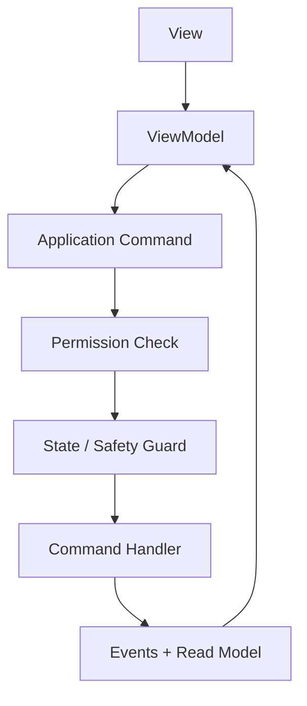

# EDR-0006 — UI Architecture, Commands and Permissions

## Decision

UTS uses one WPF/MVVM shell with six primary pages:

`Reception → Test → Method → Calibration → Settings → Report`

The label `Reception` is retained for the approved operator workflow, while its domain root is always `Order` under GR-001. Reception is therefore an Order workspace, not a competing business entity or ownership root.

The UI requests application commands and renders read models. It does not own machine state, safety decisions, PLC access, scientific calculations or authorization policy.

## Shell architecture

- One composition root creates Application services and ViewModels.
- Navigation uses stable page identities and retains authorized workspace state.
- Long-running actions are asynchronous and cancellable where safe.
- UI thread handles rendering only; acquisition, persistence and analysis never depend on it.
- Every command displays Accepted/Rejected/Failed state with stable reason mapping.
- Localization uses resource keys; domain error codes remain language-independent.

## Page ownership

| Page | Primary responsibilities |
|---|---|
| Reception | Order-rooted intake, customer context, specimens, planned tests, method/material/acceptance selection and Draft/Completed status |
| Test | Run preparation, immutable snapshot review, live measurements, charts, results, manual setup/JOG and execution commands |
| Method | Released/versioned Method library and seven-tab editor |
| Calibration | Sensor inventory, calibration revisions, zero/tare tools, diagnostics and compliance correction |
| Settings | Units, approved speed presets, soft-limit configuration, Force Zero Hold settings, users/roles, export defaults, localization and system configuration |
| Report | Result review, Re-Analyze lineage, report templates, generation, CSV/export and audit references |

## Test workspace

The Test page contains:

- Method & Situation panel;
- live Measurement Widgets;
- configurable chart area;
- Results/Quick Setting area;
- permanently visible Position/JOG panel;
- prominent Start/Hold/Resume/Stop controls;
- machine, run, safety and interlock status.

Visibility never grants permission. Position/JOG remains visible for situational awareness but Up/Down are enabled only when the authoritative command availability read model says they are allowed.

The selected JOG direction is visibly indicated. Stop uses red flashing feedback while stop is demanded or stationary acknowledgement is pending.

## Interactive Measurement Widget

Clicking a measurement widget opens actions:

- Zero/Tare;
- Diagnostics;
- Information;
- Calibration, when permitted.

Separate permanent Zero buttons are prohibited. Each action is still checked by permission, machine/run state, binding validity and Safety Supervisor; the popup does not bypass guards.

## Command pipeline

ViewModels expose `CanRequest` from a read model for usability. The command handler repeats authoritative checks to prevent TOCTOU and non-UI bypass.

## Permission model

Permissions are stable data identifiers assigned through configurable roles. The minimum catalog includes:

- `orders.view`, `orders.edit`;
- `methods.view`, `methods.editDraft`, `methods.validate`, `methods.release`, `methods.retire`;
- `machine.connect`, `machine.enterSetup`, `machine.jog`, `machine.arm`, `machine.start`, `machine.hold`, `machine.resume`;
- `calibration.view`, `calibration.perform`, `calibration.approve`, `calibration.revoke`;
- `measurements.zeroTare`, `diagnostics.view`;
- `analysis.reanalyze`, `analysis.override`, `analysis.resetOverride`;
- `results.retest`, `results.invalidate`;
- `reports.generate`, `reports.export`, `reports.design`;
- `settings.view`, `settings.edit`;
- `users.manage`, `audit.view`.

Role names are configurable bundles; authorization must not be hard-coded to role-name string comparisons.

Stop is never denied because of role. Any active operator UI/session may request Stop; lower layers still determine the assessed stop reaction. Emergency stop remains physical.

## Core command matrix

| Command | Permission | Machine state | Run state | Notes |
|---|---|---|---|---|
| Enter Setup | machine.enterSetup | Ready | None | Safety ready |
| JOG Up/Down | machine.jog | Setup | None | Press-and-hold plus all EDR-0004 interlocks |
| JOG Stop | None | Any connected | Any | Always available/idempotent |
| Zero/Tare | measurements.zeroTare | Ready or Setup | None | Valid binding; audited correction |
| Arm | machine.arm | Ready | ReadyToArm | Snapshot already persisted |
| Start | machine.start | Armed | Armed | Final readiness rechecked |
| Hold | machine.hold | Executing | Running | Capability/method permits |
| Resume | machine.resume | Holding | Paused | All guards re-evaluated |
| Stop | None | Armed/Executing/Holding/Stopping | Armed/Running/Paused/Stopping | Always requestable/idempotent |
| Re-Test | results.retest | Ready | Completed/Aborted/Faulted historical run | Creates a distinct new run/raw data |
| Re-Analyze | analysis.reanalyze | Any non-executing | Historical terminal run | Never commands machine |
| Manual override | analysis.override | Any non-executing | Historical terminal run | Reason and audit required |
| Perform calibration | calibration.perform | Calibration | None | Separate approved workflow |
| Approve calibration | calibration.approve | Ready/non-running | None | Cannot self-approve when policy forbids |
| Edit Settings | settings.edit | Ready/non-running | None | Safety-impacting settings may require reinitialize |

## UI safety rules

- Disabled appearance is not a safety control.
- No ViewModel writes a PLC register.
- No modal dialog may block Stop handling.
- Connection loss, stale status, fault and E-stop remain visible above page content.
- Closing/minimizing the window cannot sustain JOG.
- Navigation away from Test requests JOG Stop and cannot hide an unresolved motion/fault state.
- Start requires an explicit current snapshot review; stale screen selections cannot arm.
- Errors are actionable and retain stable technical reason codes for audit.

## Graph and result interaction

- Graph axes and source channels are configurable through governed Chart Profiles.
- Display decimation is isolated under EDR-0001.
- Context actions include point inspection, approved manual markers/overrides, reset override, chart export/print and overlay controls.
- Manual edits create new analysis lineage and highlighted/audited derived results; raw data remains unchanged.
- Re-Test and Re-Analyze remain separate commands and workflows.

## Verification

UI automation and Application tests must prove:

- every command is denied server/application-side when state or permission is invalid;
- Stop remains requestable during active motion and while other dialogs are open;
- JOG ends on release, focus/input loss, navigation, state change and interlock loss;
- page visibility does not grant command rights;
- role renaming does not change authorization;
- Re-Analyze never invokes machine commands;
- graph decimation never reaches analysis;
- Measurement Widget actions use the same guarded command handlers as all other entry points.

# End of EDR
