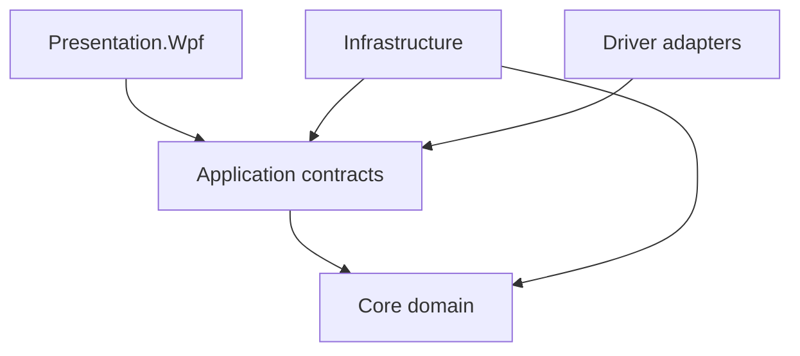

# EDR-0008 — Application and API Contracts

## Status boundary

The Project Owner approved and Froze this decision on 2026-08-03. The synchronized package becomes repository authority when its approved branch is merged into `main`; until that merge, the current `main` remains the operational baseline.

## Context

The Frozen architecture assigns command authorization, state guards, orchestration and transaction ownership to the Application layer. It also prohibits WPF ViewModels, analysis engines and drivers from reading or writing SQLite directly. A stable contract is therefore required before the real VB.NET Solution, PLC simulator and analysis engines are scaffolded.

The word API is ambiguous in a desktop industrial application. Treating it as an HTTP endpoint now would silently introduce remote control, transport security and availability decisions that have not been assessed.

## Decision

UTS v1 uses a versioned in-process Application API. Presentation calls Application commands and queries through VB.NET interfaces. Infrastructure implements Application-owned ports. Core remains free of WPF, SQLite, PLC and transport references.

No public HTTP, REST, gRPC, socket, scripting or remote-motion API is approved by this EDR. A future transport adapter may reuse non-motion Application use cases only after a separate security and safety EDR. Remote motion requires its own risk assessment and is prohibited by default.

## Dependency direction

- Application owns command/query DTOs and outbound port interfaces.
- Infrastructure references Application to implement ports; Application never references Infrastructure.
- DTOs contain no WPF, SQLite provider, PLC register or vendor-driver type.
- Composition occurs only at the executable composition root.

## Command contract

Every mutating request has an immutable `CommandEnvelope` with:

- `RequestId`: lowercase canonical GUID and idempotency identity;
- `CommandType` and positive integer `SchemaVersion`;
- `CorrelationId` and optional `CausationId`;
- `RequestedAtUtc`;
- trusted `ActorContext` supplied by the authenticated application session;
- optional aggregate identity and `ExpectedRevision` for optimistic concurrency;
- typed payload.

The UI may display permissions but may not declare the trusted actor, role or authorization result. The handler resolves the active session and repeats permission, state, interlock, freshness and concurrency checks immediately before effects.

Command outcomes use the Frozen state-machine vocabulary:

- `Accepted`: responsibility was durably accepted with an `OperationId`/correlation identity;
- `Rejected`: no requested effect occurred; a stable reason code explains why;
- `Failed`: the command was accepted but could not complete; failure and reconciliation evidence are persisted;
- `TimedOut`: final machine state is uncertain and safe-state reconciliation is mandatory.

Accepted does not mean that physical motion has completed. Completion is observed through state/read models and versioned events. The outcome includes no localized prose; UI text is resolved from stable reason codes and resource keys.

## Idempotency and concurrency

- Motion and run-control commands are idempotent by `RequestId/CorrelationId` and serialized per `MachineId`.
- Repeating the same identity and same payload returns the recorded outcome without issuing a second hardware command.
- Reusing an identity with a different payload is rejected as `CONCURRENCY.REQUEST_ID_PAYLOAD_MISMATCH`.
- Stop and JOG End are always requestable, idempotent and prioritized ahead of ordinary motion commands.
- Catalog/configuration mutations require `ExpectedRevision`; stale edits are rejected and never silently overwrite a newer revision.
- A new persistence migration must provide a general request-inbox ledger before non-machine commands are exposed through any retrying/remote transport. The in-process v1 UI may use optimistic concurrency plus audit until that migration is approved.

## Query contract

Queries are side-effect free and return immutable/read-only projections. Every query result includes:

- `ContractVersion`;
- `ProjectionVersion` or aggregate revision;
- `GeneratedAtUtc`;
- authorization-filtered data;
- explicit availability/quality fields rather than substituted zero/default values.

Queries never return live repository entities, mutable collections, SQLite connections/readers or vendor types. A query cannot arm, start, stop, zero, calibrate, analyze, export or otherwise mutate the system.

## Long-running work

Analysis, re-analysis, report generation, import and export use durable operations:

1. submit command;
2. receive `Accepted` and `OperationId`;
3. observe operation state through a query/read model;
4. receive immutable completion/failure event;
5. retrieve results by immutable revision/artifact identity.

Cancellation is explicit and permitted only for operations whose contract declares it safe. Once Stop or a protective reaction is accepted, client cancellation cannot withdraw it.

## Machine/run orchestration

Only `IMachineCommandCoordinator` and `ITestRunCoordinator` may request machine transitions. They use one fresh `InterlockSnapshot` per guard evaluation and persist the command outcome, state journal, matching domain event and current read state in the transaction boundaries defined by the Application architecture.

JOG is a renewable lease:

- `BeginJog` validates Setup state, direction, verified preset and all interlocks, then returns a short-lived `JogLeaseId`;
- `RenewJogLease` proves continued hold-to-run input and fresh session/heartbeat;
- `EndJog` is permissionless, idempotent and prioritized;
- lease expiry, focus/input loss, state change, stale heartbeat or any interlock loss requests stop;
- exact timeout and driver mapping remain open for EDR-0009/hardware verification.

The Application contract expresses `0.1 / 1 / 10 mm/min` as typed quantities. It never exposes a PLC register or assumes that the drive supports the requested preset.

## Measurement and event paths

Commands/queries are not used to transport high-rate samples.

- Acquisition writes immutable `RawSampleBatch` objects through a bounded raw-store port.
- Validation/analysis consumes streaming/replay ports with sequence, time, unit and quality provenance.
- UI reads processed live frames through a bounded projection stream; display decimation remains outside scientific inputs.
- Domain events use the Frozen event envelope and idempotent `EventId` handling.
- Re-Analyze can open controlled raw replay but cannot resolve or invoke an `IMachineDriver`.

## Transactions and publication

- One Application persistence session owns a write transaction.
- State transitions atomically append `run_state_journal`, append the matching `domain_event`, update `test_run.status`, and append audit evidence when required.
- Machine command evaluation records the immutable interlock snapshot in `command_journal`.
- A Run Configuration Snapshot and all required bindings commit before Arm is accepted.
- Raw acquisition uses short bounded chunk transactions and is never held inside a UI command transaction.
- Events are dispatched to in-process consumers only after commit. SQLite remains the durable authority; subscriber failure cannot roll back a committed safety/state fact.
- Reports and read projections use read-only sessions and may not compete as writers.

## Error and reason policy

Reason codes are stable, language-independent identifiers with the form `DOMAIN.SPECIFIC_REASON`. The initial domains are:

`AUTH`, `VALIDATION`, `CONCURRENCY`, `STATE`, `SAFETY`, `DEVICE`, `METROLOGY`, `PERSISTENCE`, `IMPORT`, `ANALYSIS`, `REPORT`, and `SYSTEM`.

Exceptions do not cross the Application boundary as normal business results. Unexpected exceptions are correlated, logged with sensitive values redacted, mapped to `SYSTEM.UNEXPECTED_FAILURE`, and never converted to an Accepted outcome.

## Typed quantities and units

Every physical command/query value uses `EngineeringQuantity(Value, QuantityKind, UnitCode)`. A unitless `Double` is prohibited for motion targets, rates, loads, lengths, stress, time or calibration data.

Application validation uses the centralized unit conversion port and EDR-0007 canonical units: N, mm, s, MPa and dimensionless strain. A file declaring force in `kgf` preserves the source value/unit and uses the exact approved conversion `1 kgf = 9.80665 N`. Output-unit selection is presentation only and never rewrites canonical scientific results.

## Security and audit boundary

- Actor identity and permissions come from a trusted session service, not a DTO field supplied by a ViewModel.
- Every sensitive mutation records actor, correlation, reason and affected aggregate/revision.
- Stop and JOG End are not denied by role.
- Secrets, credentials and raw PLC frames are not placed in UI errors or general audit payloads.
- Authentication mechanism, credential storage, signing, encryption and any external API remain open for the later validation/security package.

## Persistence delta

The Frozen initial schema already supports machine command outcomes, state journals, events and audit. Before a retrying external adapter or unattended job scheduler is enabled, a forward migration must add:

- a general application-request inbox with unique RequestId and payload hash;
- durable operation/job status and progress;
- consumer/projection checkpointing if at-least-once event replay is required.

These objects are not added by this EDR. Their SQL and migration acceptance tests require a separately reviewed forward migration under EDR-0007.

## Consequences

### Positive

- WPF, SQLite and PLC remain replaceable behind stable contracts.
- Authorization, state and Safety guards cannot be bypassed by ViewModels.
- physical commands are serialized, auditable and retry-safe;
- analysis, graphing and reporting cannot access raw data outside controlled ports;
- a future API can reuse use cases without making the current desktop process remotely controllable.

### Costs

- explicit DTO mapping and ports add code;
- long-running operations need durable status and correlation;
- optimistic concurrency and idempotency require contract tests;
- general retry-safe commands need a forward schema migration before external exposure.

## Rejected alternatives

1. **ViewModels call repositories or PLC adapters directly** — bypasses authorization, state, transactions and hardware independence.
2. **Generic REST API in v1** — introduces an unassessed remote-control and security surface.
3. **One generic `Execute(name, Dictionary)` endpoint** — removes compile-time quantity, version and permission contracts.
4. **Return provider/domain entities directly** — leaks persistence mutability and breaks versioning.
5. **Put samples on the command/event bus** — violates the measurement-stream separation.
6. **Treat command timeout as failure-to-move** — may cause duplicate or unsafe commands while physical state is uncertain.
7. **Cancellation can withdraw Stop** — contradicts safety priority and idempotent Stop.

## Verification requirements

Before Application/API implementation is complete, automated tests must prove:

- Presentation references Application contracts but not Infrastructure, SQLite or driver assemblies;
- every mutating handler repeats permission and guard checks;
- stale `ExpectedRevision` cannot overwrite data;
- duplicate motion RequestId never issues a second driver command;
- conflicting RequestId payload is rejected;
- Stop and JOG End remain requestable and idempotent;
- JOG expires on lease/heartbeat/input loss and cannot auto-resume;
- timeout enters reconciliation and never automatically resends motion;
- Arm cannot be accepted before a complete persisted snapshot and bindings;
- state journal, event and current state commit atomically;
- query handlers have no write capability;
- Re-Analyze has no machine/driver dependency;
- high-rate samples do not traverse the command/event dispatcher;
- kgf import provenance and exact N normalization are retained;
- display/export units cannot change stored canonical results;
- stable reason codes are returned without leaking sensitive details.

# End of EDR
